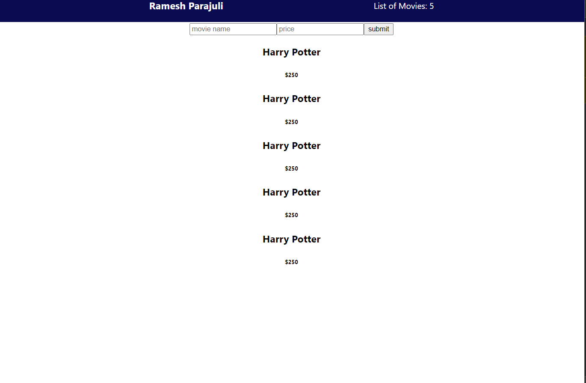
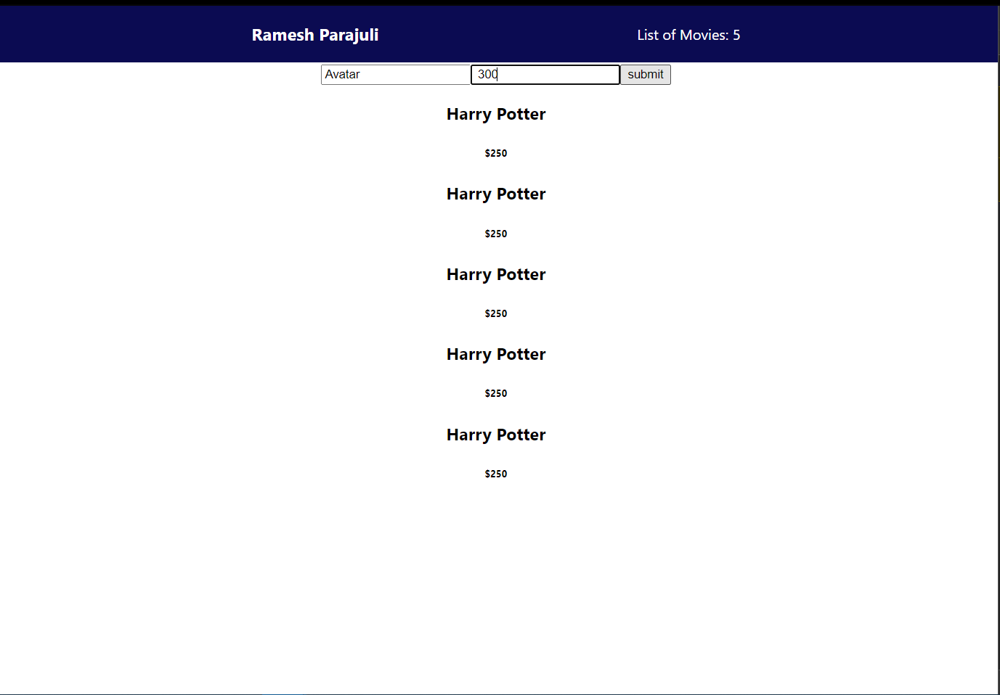
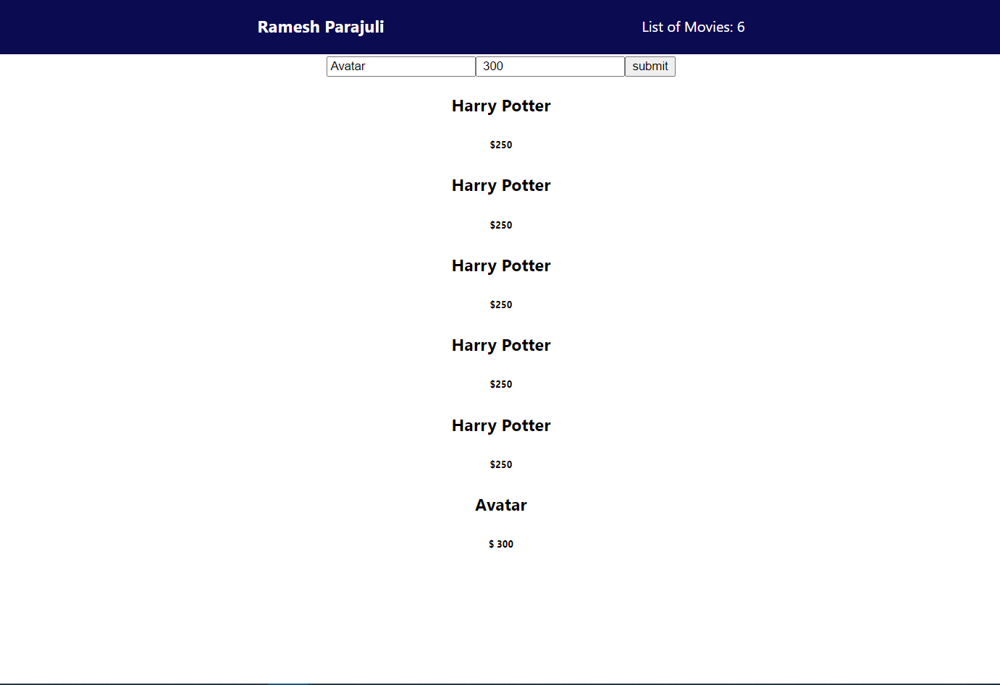

# CONTEXT-API
small project of showing movie details using context api.

Context API

1. Installation process.
> clone project
> cd context-api
> yarn or npm install

> yarn start or npm start

images

